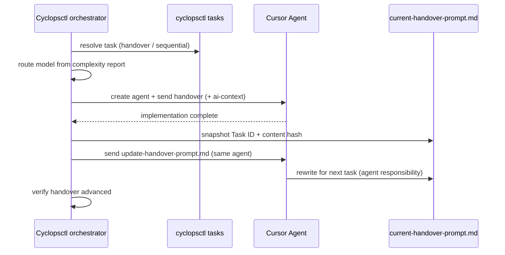

# Cyclopsctl — Cursor task orchestrator

[](https://github.com/OlaProeis/Cyclopsctl)

**Orchestrate Cursor agent task cycles from your terminal** — implement, update, verify, repeat.

Cyclopsctl is a lightweight **Cursor task orchestrator**: a Python CLI that sequences [Cursor](https://cursor.com) agent runs for **task-driven development**. On each parent task it orchestrates a strict **two-phase workflow** — an **implementation** pass (new agent), an **update** pass (same session), then **handover verification** so the queue advances. Models are routed from complexity scores; a Rich dashboard shows live progress.

**Runtime orchestration, not autonomous planning.** The orchestrator sequences agent runs, waits for completion, and **fails closed** when handovers do not advance (no silent re-runs of the same task). Task planning, documentation, and handover text stay in Markdown prompt files and a native queue under `.cyclopsctl/` — not inside the CLI.

**Who it is for:** developers running multi-task Cursor workflows who want file-based continuity (`current-handover-prompt.md`, `ai-context.md`) and a reliable **implement → update** orchestrator without manually chaining Cursor sessions.

The codebase is **100% AI-generated** (Python, docs, and config), built with the same [AI-assisted workflow](https://github.com/OlaProeis/Ferrite/blob/master/docs/ai-workflow/ai-development-workflow.md) used for [Ferrite](https://github.com/OlaProeis/Ferrite). Human work is product direction, testing, and orchestration.

---

## Quick start

The default path needs **one install** (Python package) and **one API key** (`CURSOR_API_KEY`).

### 1. Install

Pick one path. All require **Python 3.10+** only.

**Windows (recommended):**

```powershell
.\install.ps1
```

**macOS / Linux:**

```bash
./install.sh
```

**PyPI:**

```bash
pip install cyclopsctl
# or isolated global install
pipx install cyclopsctl
```

**Git (one line, no clone):**

```bash
pip install "cyclopsctl @ git+https://github.com/OlaProeis/Cyclopsctl.git"
```

Verify:

```bash
cyclopsctl --version
cyclopsctl doctor --help
```

Copy **`.env.example`** to **`.env`** in the target project (or export the variable). Set **`CURSOR_API_KEY`** there — loaded automatically from the project root.

---

### 2. New project

In your project repo (not this dev repo), add **`CURSOR_API_KEY`** to **`.env`** and write **`prd.md`**, then:

```bash
cyclopsctl init
cyclopsctl launch    # same as bare `cyclopsctl`
```

That is the full default path — no separate bootstrap step, profile flag, or doctor run required.

**`cyclopsctl init`** scaffolds `cyclopsctl.toml` and workflow files, parses `prd.md` into the native task queue, runs complexity analysis, and syncs the first handover when prerequisites are met.

**`cyclopsctl launch`** (also the default when you run bare **`cyclopsctl`**) runs preflight checks, shows queue status, lets you pick cycle count and options, then starts implement → update cycles.

Optional extras (not part of the default path):

| Command | When |
|---------|------|
| `cyclopsctl doctor` | Read-only diagnostics any time; launch already runs checks before a run |
| `cyclopsctl bootstrap --from-prd prd.md` | Re-parse a PRD without a full init, or if you added `prd.md` after an attach-only setup |
| `cyclopsctl init --profile solo-default` | Seed named routing defaults in `cyclopsctl.toml` (power user) |

---

### 3. Existing project

```bash
cd /path/to/your-project
cyclopsctl init      # idempotent — repairs and catches up when needed
cyclopsctl launch
```

Already initialized with pending tasks? **`cyclopsctl launch`** alone is enough.

**PRD changed?** **`launch`** can detect that and offer to re-parse; or run **`cyclopsctl bootstrap --from-prd prd.md`** explicitly.

Most commands default to the **current working directory** as the project root. Run `cyclopsctl doctor` and `cyclopsctl status` from inside your project without passing `--project-root`.

---

## What the orchestrator does (and does not do)

| The orchestrator **does** | The orchestrator **does not** |
|---------------------------|-------------------------------|
| Run **implement → update** cycles with handover verification | Plan tasks or edit `tasks.json` during cycles |
| **`init`** — scaffold, PRD parse, analyze, and handover sync in one step | Rewrite handover templates |
| Interactive **`launch`** and direct **`run`** | Choose the next task in handover files (update agent does) |
| Route models from the complexity report | Manage nested task hierarchies |
| Inject `ai-context.md` into implementation prompts | Replace the update agent's handover or doc duties |
| Preflight via **`doctor`**, Rich dashboard, resume history | |
| **`bootstrap`** — optional explicit PRD re-parse | |

Workflow rules live in your prompt files. The update agent marks tasks done, updates docs, and prepares the next handover.

---

## Prerequisites

- **Python 3.10+**
- **`CURSOR_API_KEY`** — project-root `.env` or environment (auto-loaded; `--no-env` to skip)
- **`cursor-sdk`** — installed with this package
- Target repository with **`prd.md`**, **`CURSOR_API_KEY`**, and handover templates (`current-handover-prompt.md`, `update-handover-prompt.md`) and `ai-context.md` — the latter three are created by **`init`** when missing

On **Windows**, the cyclopsctl bootstraps the Cursor SDK bridge automatically when needed.

Native task storage lives under `.cyclopsctl/tasks/` and `.cyclopsctl/reports/`. Use `cyclopsctl tasks` for queue operations.

### Security

- **Never commit `.env`** — it is gitignored by default (`cyclopsctl init` adds the entry). Use `.env.example` as a template with empty values only.
- **Local dev folders:** `/.cursor/` MCP/rules/commands and runtime `.cyclopsctl/` state are gitignored in this repo. Native task data belongs in `.cyclopsctl/` at runtime in target projects.
- **Cursor MCP config:** copy `.cursor/mcp.json.example` to `.cursor/mcp.json` when needed and keep real keys out of git.
- Before your first public push, confirm no secrets are tracked: `git status` should not list `.env`, and `git log -p -- .env` should be empty.

---

## Advanced CLI reference

### Commands

| Command | Description |
|---------|-------------|
| `cyclopsctl` | **Default:** interactive launcher (`launch`) |
| `cyclopsctl launch` | Preflight + Rich menu → spawn `run` |
| `cyclopsctl init` | Scaffold `cyclopsctl.toml`, workflow stubs, `.gitignore` |
| `cyclopsctl bootstrap` | PRD → parse → analyze → sync handover |
| `cyclopsctl run` | Run N verified implement → update cycles |
| `cyclopsctl doctor` / `check` | Preflight diagnostics |
| `cyclopsctl tasks` | Native task queue CRUD — `list` (table), `list pending` / `done`, `show`, `next`, `set-status` |
| `cyclopsctl status` | Crash-recovery state and run history summary |
| `cyclopsctl models` | List Cursor models and routing preset availability |

Shared flags on most commands: `--no-env`, `--config`, `--project-root` (defaults to cwd), `--plain` (where applicable).

### `init`

| Flag | Description |
|------|-------------|
| `--project-root PATH` | Target repository (default: cwd) |
| `--profile NAME` | Merge named profile defaults into seeded `cyclopsctl.toml` |
| `--skip-templates` | Write config only; skip workflow stubs |
| `--dry-run` | List paths that would be written |
| `--force PATH` / `--force-all` | Overwrite existing scaffold files |
| `--attach` | Attach to existing queue without PRD (brownfield) |
| `--yes` | Skip interactive confirms |

### `bootstrap`

| Flag | Description |
|------|-------------|
| `--from-prd PATH` | PRD file (default: `prd.md`) |
| `--with-workflow` | Generate PRD-aware `ai-context.md`, handover template, `docs/index.md` |
| `--sync-handover-only` | Regenerate handover from existing tasks |
| `--skip-analyze` | Skip complexity analysis after parse-prd |
| `--append` | Append tasks when re-parsing PRD |

### `run`

| Flag | Description |
|------|-------------|
| `--config FILE` | Load `cyclopsctl.toml` |
| `--cycles N` | Number of cycles to run |
| `--project-root PATH` | Target repository (default: cwd) |
| `--profile NAME` | Merge profile defaults (CLI overrides profile) |
| `--tag NAME` | Task tag context |
| `--task-source MODE` | `handover` (default) or `sequential` |
| `--task-id N` | Pin the next cycle to a specific pending task |
| `--strict-handover` | Fail when handover Task ID ≠ selected task |
| `--resume` | Skip completed parent tasks from run history |
| `--fresh` | Force first-prompt bootstrap; ignore ready handover |
| `--plain` | Disable Rich dashboard; plain text logs |
| `--retry-on transient` | Retry transient SDK/network failures |
| `--dry-run` | Resolve task and model without starting an agent |

See [`cyclopsctl.toml.example`](cyclopsctl.toml.example) for full TOML options including **`[routing]`** rules, **`[profile.*]`** presets, **`[tasks]`** parse/analyze models, and **`task_source`**.

### `tasks`

Inspect and update the native queue under `.cyclopsctl/tasks/`. Run from the project root (or pass `--project-root`).

| Command | Description |
|---------|-------------|
| `cyclopsctl tasks list` | **All tasks** — Rich table with ID, title, status, complexity, dependencies |
| `cyclopsctl tasks list pending` | Non-done tasks (same table; used by update-phase handover selection) |
| `cyclopsctl tasks list done` | Completed tasks only |
| `cyclopsctl tasks list <status>` | Exact filter (`in-progress`, `review`, `cancelled`, `blocked`, `deferred`) |
| `cyclopsctl tasks show <id>` | Full task record (`--format json` for scripts) |
| `cyclopsctl tasks next` | Lowest `pending` task whose dependencies are all `done` |
| `cyclopsctl tasks set-status --id=<id> --status=done` | Update status and `updatedAt` |

Shared flags: `--project-root`, `--tag`, `--format json|plain`. Use `--plain-table` with plain format for a fixed-width text table (no Rich).

Full reference: [`docs/tasks/tasks-cli.md`](docs/tasks/tasks-cli.md).

### Tags and profiles

- **Tags:** pass `--tag NAME` on `run` / `launch`, or set `tag = "..."` in `cyclopsctl.toml`.
- **Profiles:** named `[profile.solo-default]` (and custom) tables in `cyclopsctl.toml`; seed via `cyclopsctl init --profile NAME`. CLI flags override profile values.

### Model routing

Reads `.cyclopsctl/reports/complexity-report.json`:

| Complexity score | Default model |
|----------------|---------------|
| 1–8 | `composer-2.5` |
| 9–10 | Opus 4.8 **high thinking** (not Max Mode) |

Optional **`[routing]`** in TOML sets score bands, `composer_tier`, `opus_enabled`, and fallbacks. Inspect presets with `cyclopsctl models`.

### Exit codes

| Code | Meaning |
|------|---------|
| `0` | Completed cycles, empty queue stop, or successful doctor/status |
| `1` | Startup / configuration failure |
| `2` | Agent run failure or handover verification failure |
| `130` | Interrupted (Ctrl+C)—agent closed, state preserved |

---

## How it works

Each cycle is one **parent task**. The orchestrator runs **implementation** (new agent), **update** (same agent), then **verification** (handover must advance).



**Cycle 1** uses `current-handover-prompt.md` when it exists with `# Task ID:` — the normal case after `bootstrap`.

**Bootstrap only** uses `first_prompt` (e.g. `prompts/setup-ai-workflow.md`) when the handover is missing or you pass **`--fresh`**.

### Task selection

| Mode | Behavior |
|------|----------|
| `handover` (default) | Task id from `# Task ID:` in handover file |
| `sequential` | Lowest numeric pending task id |

### Handover verification

After every update phase, the orchestrator compares before/after snapshots of `current-handover-prompt.md`. The run **fails** if Task ID and substantive content are unchanged—stuck on the same task.

See [`docs/tasks/task-selection.md`](docs/tasks/task-selection.md), [`docs/workflow/handover-verification.md`](docs/workflow/handover-verification.md), and [`docs/runtime/run-history.md`](docs/runtime/run-history.md) for details.

---

## Handover file conventions

| File | Role |
|------|------|
| `current-handover-prompt.md` | Next implementation task; must include `# Task ID: <n>` (parent only); rewritten by update agent |
| `update-handover-prompt.md` | Fixed template; orchestrator passes through unchanged |
| `ai-context.md` | Prepended to implementation prompts; phase rules for agents |

See `ai-context.md` in this repo for the canonical rule set.

---

## Project layout

```
Cyclopsctl/
├── src/cyclopsctl/            # Python package
├── install.ps1 / install.sh   # Global install scripts
├── docs/                      # Feature-level technical docs (see docs/index.md)
│   ├── guides/                # User guides and technical brief
│   ├── setup/                 # Install, init, config, bootstrap
│   ├── workflow/              # Handover and workflow file generation
│   ├── tasks/                 # Native task queue and PRD parse
│   ├── runtime/               # Run loop, agents, observability
│   ├── cli/                   # CLI command reference
│   ├── testing/               # Regression and readiness docs
│   └── prd.md                 # Product requirements (this repo)
├── prompts/                   # Bootstrap templates
├── cyclopsctl.toml.example
├── ai-context.md              # Agent phase rules (generated or maintained per project)
└── current-handover-prompt.md # Next implementation task (update agent rewrites)
```

Module-level documentation: [`docs/index.md`](docs/index.md). Agent-oriented overview: [`docs/guides/technical-brief.md`](docs/guides/technical-brief.md).

---

## Development and testing

```bash
pip install -e ".[dev]"
python -m pytest
```

For manual validation on a **fresh directory** or an **existing repository**, follow [`docs/guides/testing-guide.md`](docs/guides/testing-guide.md). It covers greenfield init → launch, brownfield attach/continue scenarios, and automated pytest regression.

The orchestrator is intentionally small: thin CLI, logic in focused modules, strict error handling, native tasks only.

---

## Design philosophy

1. **Orchestrate runs, not plans** — Sequence agent cycles, routing, and verification; task content lives in prompts and the native queue.
2. **Scenario-first adoption** — `init` and `launch` are the default path; `run` and flags remain for automation.
3. **File-based continuity** — Prompts, handovers, and `ai-context.md` are the workflow contract.
4. **Two-phase discipline** — Implementation agents implement; update agents mark done and advance handovers.
5. **Fail closed on stuck handovers** — Better to stop than loop the same task unnoticed.

Full product requirements: [`docs/prd.md`](docs/prd.md).

---

## License

MIT — see [`LICENSE`](LICENSE).
