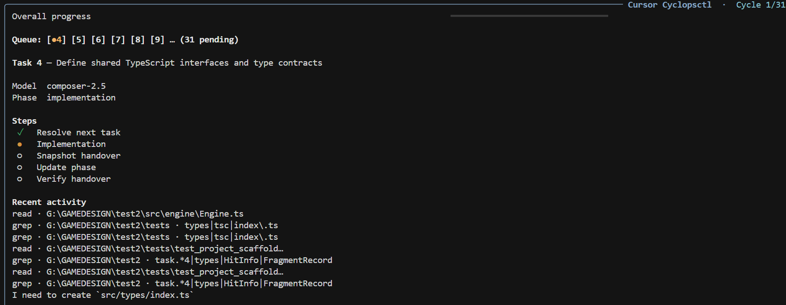
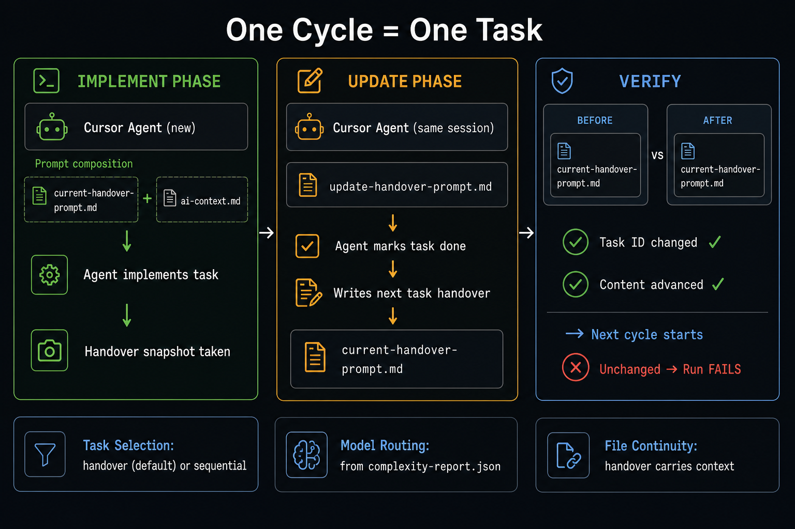

# Cyclopsctl: Cursor Task Orchestrator

[](https://github.com/OlaProeis/Cyclopsctl)
[](https://www.python.org/)
[](LICENSE)
[](https://cursor.com)
[](https://pypi.org/project/cursor-sdk/)
[](#prerequisites)
[](https://github.com/OlaProeis/Cyclopsctl/pulls)
[](#)

**Run Cursor agents in structured cycles from your terminal. Implement, verify, repeat.**

Cyclopsctl is a Python CLI that sequences [Cursor](https://cursor.com) agent runs to execute tasks from a PRD end-to-end. You write a product requirements doc (`prd.md`), run `cyclopsctl init`, and let the orchestrator drive implement → update → verify cycles until the queue is empty.

Each cycle is one task. The orchestrator picks the task, routes the right model based on complexity, runs a **two-phase workflow** (implement + update in the same agent session), then verifies the handover file advanced before moving on. It **fails closed**: if the handover didn't change, the run stops rather than silently repeating the same task.

**Who it's for:** Solo developers and small teams building with Cursor who want to turn a solid PRD into working software with minimal manual chaining of agent runs. File-based continuity (`current-handover-prompt.md`, `ai-context.md`) keeps context intact across sessions.



> The codebase is 100% AI-generated (Python, docs, and config), built with the same [AI-assisted workflow](https://github.com/OlaProeis/Ferrite/blob/master/docs/ai-workflow/ai-development-workflow.md) used for [Ferrite](https://github.com/OlaProeis/Ferrite).

---

## Tips for best results

**Write a detailed PRD.** The quality of your output depends heavily on the quality of your `prd.md`. Vague requirements produce vague tasks; detailed requirements produce precise, actionable tasks. We recommend drafting your PRD with Opus before running cyclopsctl: use it interactively to think through features, edge cases, tech stack choices, and scope. The better the PRD, the better the parsed tasks, the better the results. See [`prd.example.md`](prd.example.md) for a full annotated example showing what to include and why.

**Build in phases, not all at once.** Don't try to build a large application in a single PRD. Start with a focused v1 scope, build it, validate it, then write a second PRD for the next phase. Phase 2 PRDs are a great place to include bug fixes, refinements, and new features based on what you learned from phase 1. Cyclopsctl supports multi-phase builds natively with tags, so each phase gets its own task queue while keeping previous phase history intact.

---

## How it works



You start with a `prd.md`. `cyclopsctl init` parses it into a task queue, scores each task for complexity, and prepares the first handover file. `cyclopsctl launch` then drives the loop: for each task, a new Cursor agent implements it, the same agent session handles the update (marks the task done and prepares the next handover), and the orchestrator verifies progress before continuing.

The **handover file** (`current-handover-prompt.md`) is the contract between cycles; it carries the task context forward. The orchestrator snapshots it before the update phase and checks that the Task ID and content actually changed. If they didn't, the run fails rather than silently looping.

---

## Quick start

Requires **Python 3.10+** and a `CURSOR_API_KEY`.

### 1. Install

**From GitHub (no clone needed):**

```bash
pip install "cyclopsctl @ git+https://github.com/OlaProeis/Cyclopsctl.git"
```

**Or use the install scripts (after cloning):**

```bash
# Windows
.\install.ps1

# macOS / Linux
./install.sh
```

Verify the install:

```bash
cyclopsctl --version
```

Copy `.env.example` to `.env` in your project and set `CURSOR_API_KEY`. Cyclopsctl loads it automatically from the project root.

---

### 2. New project

In your project repo, write a `prd.md` describing what you want to build (see `prd.example.md` for structure — `init` copies this annotated example into your project), then:

```bash
cyclopsctl init      # parse PRD → task queue → first handover
cyclopsctl launch    # start the implement → update cycles
```

`init` scaffolds `cyclopsctl.toml`, workflow files, and `prd.example.md`, parses `prd.md` into the native task queue, runs complexity scoring, and writes the first handover. `launch` runs preflight checks, shows queue status, lets you confirm options, and starts the cycles.

---

### 3. Existing project

```bash
cd /path/to/your-project
cyclopsctl init      # idempotent, repairs and catches up as needed
cyclopsctl launch
```

If the project is already initialized and has pending tasks, `launch` alone is enough. If you've changed your `prd.md`, `launch` detects it and offers to re-parse into a new phase.

---

## What the orchestrator does (and doesn't do)

| The orchestrator **does** | The orchestrator **does not** |
|---------------------------|-------------------------------|
| Run implement → update cycles with handover verification | Plan tasks or edit `tasks.json` during cycles |
| `init`: scaffold, PRD parse, complexity scoring, handover sync | Rewrite handover templates |
| Interactive `launch` and direct `run` | Choose the next task (the update agent does that) |
| Route models by complexity score | Manage nested task hierarchies |
| Inject `ai-context.md` into implementation prompts | Replace the update agent's handover or doc duties |
| Preflight via `doctor`, Rich dashboard, resume history | |
| `bootstrap`: explicit PRD re-parse when needed | |

Task planning and workflow rules live in your prompt files. The update agent marks tasks done, updates docs, and writes the next handover.

---

## Prerequisites

- **Python 3.10+**
- **`CURSOR_API_KEY`** — set in your project's `.env` or as an environment variable (auto-loaded; pass `--no-env` to skip)
- **`cursor-sdk`** — installed automatically with this package
- A project with **`prd.md`** — `cyclopsctl init` creates the required workflow files (`current-handover-prompt.md`, `update-handover-prompt.md`, `ai-context.md`) when they're missing

On **Windows**, cyclopsctl bootstraps the Cursor SDK bridge automatically (`managed_sdk_bridge`) for `launch`, `run`, `init`, `bootstrap`, `models`, and `analyze-complexity`. This avoids Python 3.11 crashes when `cursor-sdk` auto-launches its local bridge (`os.get_blocking` / pipe discovery).

Task state lives under `.cyclopsctl/tasks/` and `.cyclopsctl/reports/`. Use `cyclopsctl tasks` to inspect and manage the queue.

---

## CLI reference

### Commands

| Command | Description |
|---------|-------------|
| `cyclopsctl` | **Default:** interactive launcher (`launch`) |
| `cyclopsctl launch` | Preflight + Rich menu, spawn `run` |
| `cyclopsctl init` | Scaffold `cyclopsctl.toml`, workflow stubs, `.gitignore` |
| `cyclopsctl bootstrap` | PRD → parse → analyze → sync handover |
| `cyclopsctl analyze-complexity` | Score pending tasks on the active tag (no PRD parse) |
| `cyclopsctl run` | Run N verified implement → update cycles |
| `cyclopsctl doctor` / `check` | Preflight diagnostics |
| `cyclopsctl tasks` | Task queue CRUD: `list`, `list pending` / `done`, `show`, `next`, `set-status` |
| `cyclopsctl status` | Crash-recovery state and run history summary |
| `cyclopsctl models` | List Cursor models and routing preset availability |

Shared flags on most commands: `--no-env`, `--config`, `--project-root` (defaults to cwd), `--plain`.

### `init`

| Flag | Description |
|------|-------------|
| `--project-root PATH` | Target repository (default: cwd) |
| `--profile NAME` | Merge named profile defaults into seeded `cyclopsctl.toml` |
| `--skip-templates` | Write config only; skip workflow stubs |
| `--dry-run` | List paths that would be written |
| `--force PATH` / `--force-all` | Overwrite existing scaffold files |
| `--attach` | Attach to existing queue without PRD (brownfield) |
| `--yes` | Skip interactive confirms |

### `bootstrap`

| Flag | Description |
|------|-------------|
| `--from-prd PATH` | PRD file (default: `prd.md`) |
| `--with-workflow` | Generate PRD-aware `ai-context.md`, handover template, `docs/index.md` |
| `--sync-handover-only` | Regenerate handover from existing tasks |
| `--skip-analyze` | Skip complexity analysis after parse-prd |
| `--append` | Append tasks when re-parsing PRD |

### `analyze-complexity`

Score pending tasks via Cursor SDK and write `.cyclopsctl/reports/complexity-report.json`. Does **not** parse a PRD — use after a new phase tag when tasks lack complexity, or when `init` refuses with *PRD changed — run `cyclopsctl launch`*.

```bash
cyclopsctl tasks use-tag phase-2   # if needed
cyclopsctl analyze-complexity
```

| Flag | Description |
|------|-------------|
| `--project-root PATH` | Target repository (default: cwd) |
| `--tag NAME` | Tag to analyze (default: active tag) |
| `--analyze-model MODEL` | Override analyze model (default: `auto`) |
| `--skip-if-exists` | Skip when complexity report already exists |

By default this command **re-runs** analysis and replaces a stale report (e.g. from a prior phase). See [`docs/cli/analyze-complexity-cli.md`](docs/cli/analyze-complexity-cli.md).

### `run`

| Flag | Description |
|------|-------------|
| `--config FILE` | Load `cyclopsctl.toml` |
| `--cycles N` | Number of cycles to run |
| `--project-root PATH` | Target repository (default: cwd) |
| `--profile NAME` | Merge profile defaults (CLI overrides profile) |
| `--tag NAME` | Task tag context |
| `--task-source MODE` | `handover` (default) or `sequential` |
| `--task-id N` | Pin the next cycle to a specific pending task |
| `--strict-handover` | Fail when handover Task ID differs from selected task |
| `--resume` | Skip completed parent tasks from run history |
| `--fresh` | Force first-prompt bootstrap; ignore ready handover |
| `--plain` | Disable Rich dashboard; plain text logs |
| `--retry-on off` | Disable default transient retry (SDK blips and empty-detail run errors) |
| `--dry-run` | Resolve task and model without starting an agent |

See [`cyclopsctl.toml.example`](cyclopsctl.toml.example) for full TOML options including `[routing]` rules, `[profile.*]` presets, `[tasks]` parse/analyze models, and `task_source`.

### `tasks`

Inspect and update the native queue under `.cyclopsctl/tasks/`. Run from the project root or pass `--project-root`.

| Command | Description |
|---------|-------------|
| `cyclopsctl tasks list` | All tasks: Rich table with ID, title, status, complexity, dependencies |
| `cyclopsctl tasks list pending` | Non-done tasks |
| `cyclopsctl tasks list done` | Completed tasks only |
| `cyclopsctl tasks list <status>` | Filter by status (`in-progress`, `review`, `cancelled`, `blocked`, `deferred`) |
| `cyclopsctl tasks show <id>` | Full task record (`--format json` for scripts) |
| `cyclopsctl tasks next` | Lowest pending task whose dependencies are all done |
| `cyclopsctl tasks set-status --id=<id> --status=done` | Update status |
| `cyclopsctl tasks tags` | List tags/phases with total / done / pending counts |
| `cyclopsctl tasks use-tag <name>` | Switch the active tag context |

Shared flags: `--project-root`, `--tag`, `--format json|plain`. Full reference: [`docs/tasks/tasks-cli.md`](docs/tasks/tasks-cli.md).

### Tags, phases, and profiles

- **Tags** group tasks by phase. Pass `--tag NAME` on `run` / `launch`, or set `tag = "..."` in `cyclopsctl.toml`. Inspect and switch with `cyclopsctl tasks tags` / `cyclopsctl tasks use-tag <name>`.
- **Multi-phase PRDs:** each PRD/phase maps to its own tag. Start the next phase with `cyclopsctl launch --prd prd-phase2.md` — launch parses into a fresh tag, runs complexity scoring (even when a prior-phase report exists), syncs a clean handover, and keeps previous phases as history. If tasks on a new tag have no complexity scores, run `cyclopsctl analyze-complexity` (do not use `init` after a PRD change on a mature project). See [`docs/cli/launch-prd-change.md`](docs/cli/launch-prd-change.md) and [`docs/cli/analyze-complexity-cli.md`](docs/cli/analyze-complexity-cli.md).
- **Profiles:** named `[profile.solo-default]` tables in `cyclopsctl.toml`; seed via `cyclopsctl init --profile NAME`. CLI flags override profile values.

### Model routing

Reads `.cyclopsctl/reports/complexity-report.json`:

| Complexity score | Default model |
|----------------|---------------|
| 1–8 | `composer-2.5` |
| 9–10 | Opus 4.8 high thinking |

Optional `[routing]` in TOML sets score bands, `composer_tier`, `opus_enabled`, and fallbacks. Inspect presets with `cyclopsctl models`.

### Exit codes

| Code | Meaning |
|------|---------|
| `0` | Completed cycles, empty queue stop, or successful doctor/status |
| `1` | Startup / configuration failure |
| `2` | Agent run failure or handover verification failure |
| `130` | Interrupted (Ctrl+C): agent closed, state preserved |

---

## Handover file conventions

| File | Role |
|------|------|
| `current-handover-prompt.md` | Next implementation task; must include `# Task ID: <n>`; rewritten by the update agent each cycle |
| `update-handover-prompt.md` | Fixed template; passed through unchanged by the orchestrator |
| `ai-context.md` | Prepended to implementation prompts; carries phase rules and project context for agents |
| `.cursor/skills/cyclopsctl/SKILL.md` | Cursor agent skill for ad-hoc task/CLI help outside runs; installed on `init`, commit in your repo |

See `ai-context.md` in this repo for the canonical rule set.

---

## Project layout

```
Cyclopsctl/
├── src/cyclopsctl/            # Python package
├── install.ps1 / install.sh   # Global install scripts
├── docs/                      # Feature-level technical docs (see docs/index.md)
│   ├── guides/                # User guides and technical brief
│   ├── setup/                 # Install, init, config, bootstrap
│   ├── workflow/              # Handover and workflow file generation
│   ├── tasks/                 # Native task queue and PRD parse
│   ├── runtime/               # Run loop, agents, observability
│   ├── cli/                   # CLI command reference
│   ├── testing/               # Regression and readiness docs
│   └── prd.md                 # Product requirements (this repo)
├── prompts/                   # Bootstrap templates
├── .cursor/skills/cyclopsctl/ # Operator skill (committed here; copied to target repos on init)
├── cyclopsctl.toml.example
├── ai-context.md              # Agent phase rules
└── current-handover-prompt.md # Next implementation task (update agent rewrites)
```

Module-level documentation: [`docs/index.md`](docs/index.md). Agent-oriented overview: [`docs/guides/technical-brief.md`](docs/guides/technical-brief.md).

---

## Development and testing

```bash
pip install -e ".[dev]"
python -m pytest
```

**Windows:** if `pip install -e .` fails with `WinError 32` (`cyclopsctl.exe` in use), close terminals running cyclopsctl and run:

```powershell
Get-Process cyclopsctl -ErrorAction SilentlyContinue | Stop-Process -Force
pip install -e .
```

While the exe is locked, use `python -m cyclopsctl …` to run the editable build. See [`docs/setup/package-distribution.md`](docs/setup/package-distribution.md#troubleshooting-installs-windows).

For manual validation on a fresh directory or an existing repository, follow [`docs/guides/testing-guide.md`](docs/guides/testing-guide.md). It covers greenfield init → launch, brownfield attach/continue scenarios, and automated pytest regression.

---

## Design philosophy

1. **Orchestrate runs, not plans.** Sequence agent cycles, routing, and verification; task content lives in prompts and the native queue.
2. **Scenario-first adoption.** `init` and `launch` are the default path; `run` and flags are there for automation and power users.
3. **File-based continuity.** Prompts, handovers, and `ai-context.md` are the workflow contract between sessions.
4. **Two-phase discipline.** Implementation agents implement; update agents mark done and advance handovers.
5. **Fail closed on stuck handovers.** Better to stop than to silently loop the same task.

Full product requirements: [`docs/prd.md`](docs/prd.md).

---

## License

MIT, see [`LICENSE`](LICENSE).
